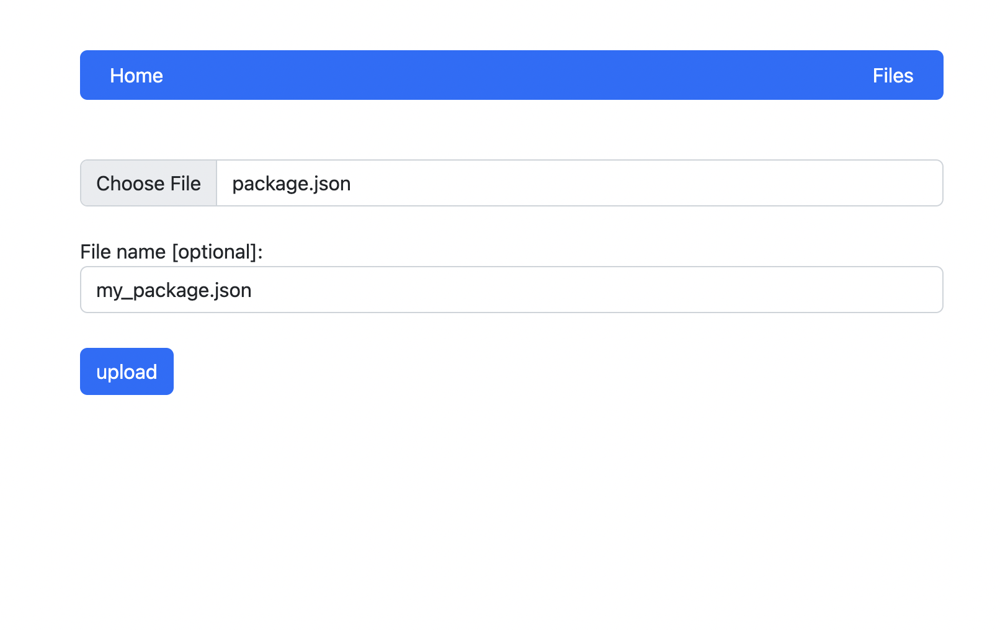
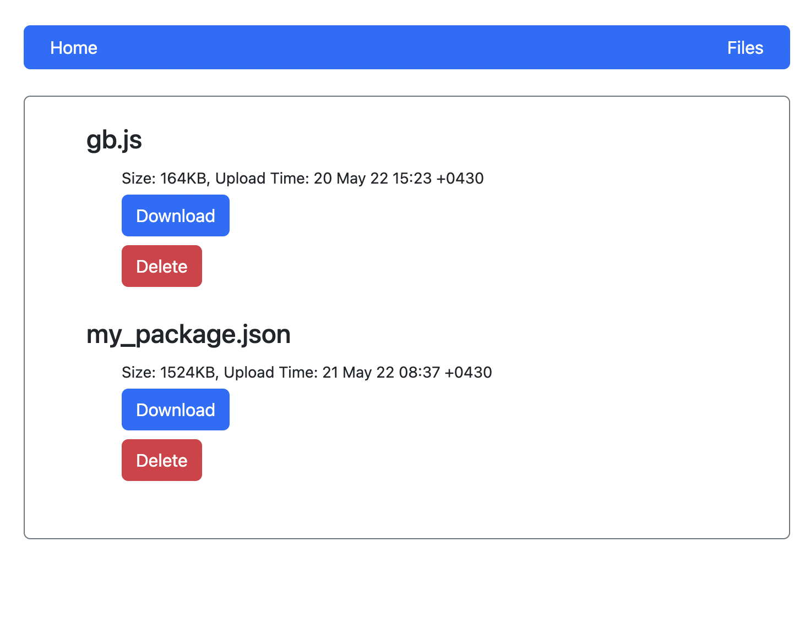

<p align="center">
    
</p>

<br />

<h1 align="center">
FHS (File Handling System)
</h1>

<br />

File handling system with Golang programming language and S3 database. 
A simple file server where you can upload, download, remove your files. 
Your files will be stored into a S3 which is an Object Storage.
The main idea behind this project is to work with Media in Golang and S3 Object Storage.

## How to use this project?

#### Using Docker

```shell
docker-compose up -d
```

#### Using Golang

```shell
go run main.go
```

You will have the server running on **localhost:8080** and
metrics on **localhost:1240**

## Demo

<br />

<p align="center">
    <br /><br />
    
</p>
